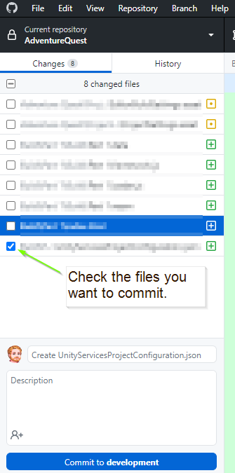
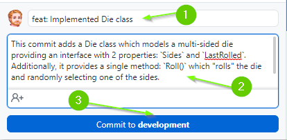
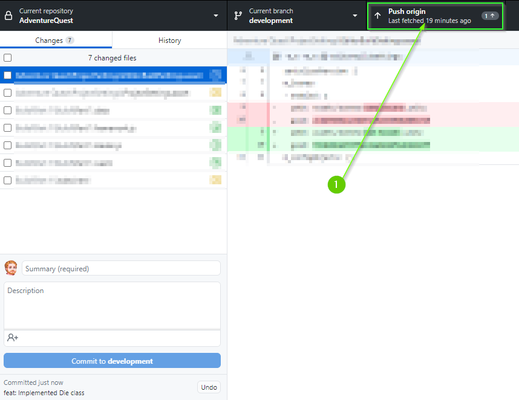

<details  open  markdown="block">
  <summary>
    <h2 style="display:inline">Committing with GitHub Desktop (Click to Expand)</h2>
  </summary>
  1. Ensure the files you would like to commit are checked in the `Changes` tab.



2. Enter a summary for your commit. Think of this as the subject line of an
   email. It should be **SHORT** and to the point. Aim to be less than 50
   characters. It is good practice to prefix the commit with the **type** of
   work that was done. For example:

   * A feature: `feat: Implemented Die class`
   * A chore: `chore: Added image assets to project`
   * A bug fix: `fix: Removed off by 1 error`
   * A work in progress: `wip: Partial implementation of DieGroup class`

3. Add a description to your commit. This should provide additional details
   about what is included in the commit. For example:


```
This commit adds a Die class which models a multi-sided die providing an
interface with 2 properties: `Sides` and `LastRolled`. Additionally, it provides
a single method: `Roll()` which "rolls" the die and randomly selecting one of
the sides.

Additionally, added unit tests to test the Die class specification.
```


4. When you're ready, click the `Commit` button



5. Lastly, push your commit to GitHub by clicking the `Push origin` button


</details>
