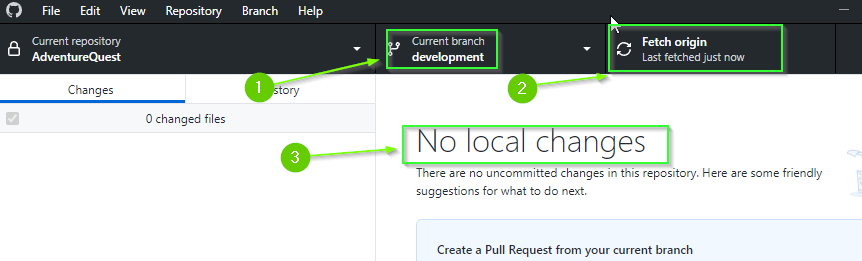
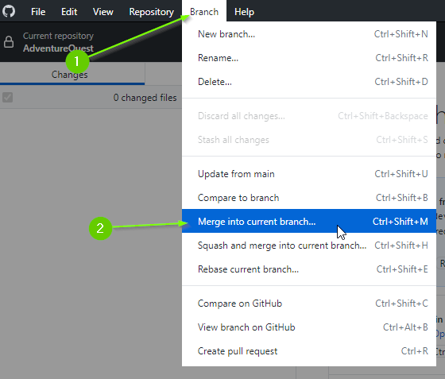
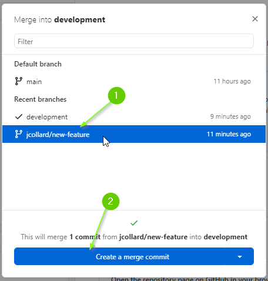
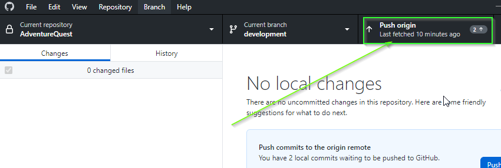
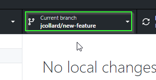
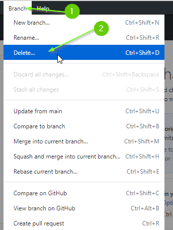
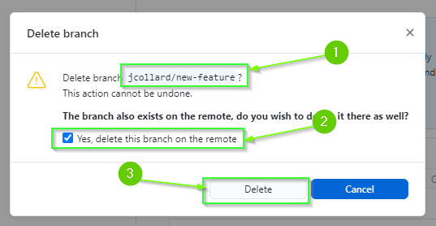

  

    <h2 style="display:inline">Merging with GitHub Desktop (Click to Expand)</h2>
  

On a team, you would typically create a **[Pull
Request](https://docs.github.com/en/pull-requests/collaborating-with-pull-requests/proposing-changes-to-your-work-with-pull-requests/about-pull-requests)**
into your `development` branch and request a code review. After the review is
complete, you would merge your changes into the `development` branch and delete
your `feature` branch.

If you are working on a project alone, there is no reason to create a **Pull
Request**. Instead, you can merge directly into your `development` branch.

1. Ensure you are on the `development` branch.
2. Click the `Fetch` button to ensure you're synced with GitHub
3. Ensure that you have `No local changes` (you may need to push first)

Although it isn't **absolutely** necessary for there to be `No local
changes`, you will save yourself a lot of potential pain by ensuring you're not
merging into a "dirty" state.
{: .note } 

4. From the top menu select `Branch` > `Merge into current branch...`

5. Select your feature branch
6. Click `Create a merge commit`

In a team, you will often make a `Squash and merge commit` which takes all of
the commits from your feature branch and reduces it to a single commit. When you
have multiple devs, this can help reduce clutter in the commit history.
{: .note } 

7. Push your changes to GitHub

Finally, we can delete the feature branch.

8. Switch to your feature branch. 

{: .warning }

**MAKE SURE YOU ARE ON YOUR FEATURE BRANCH. DELETING THE BRANCH IS PERMANENT! DO
NOT DELETE THE `development` BRANCH**

9. From the top menu select `Branch` > `Delete`

10. Ensure you are deleting the correct branch (you can't undo this!)
11. Select, `Yes, delete this branch on the remote` (this will delete it on GitHub too)
12. Click `Delete`

13. Lastly, if necessary, switch back to your `development` branch to continue working.

---