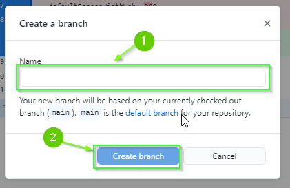

  

    <h2 style="display:inline">Creating a Branch with GitHub Desktop (Click to Expand)</h2>
  

1. Select your project repository from the `Current repository` drop down.
2. Click the `Current branch` drop down.
3. Click `New branch`

A dialog will open.

4. Enter the name of the new branch (e.g. `{{ include.branch_name }}`)
5. Click `Create branch`

6. Publish your branch to GitHub by clicking the `Publish branch` button.

