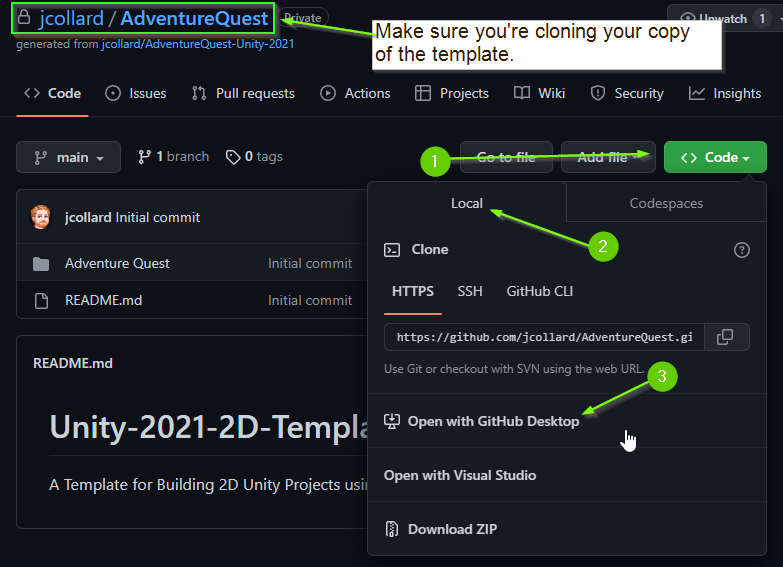
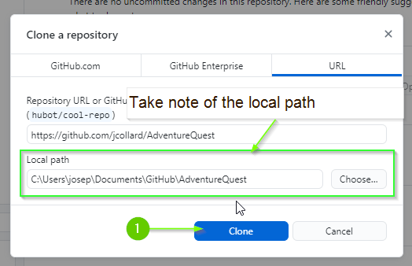
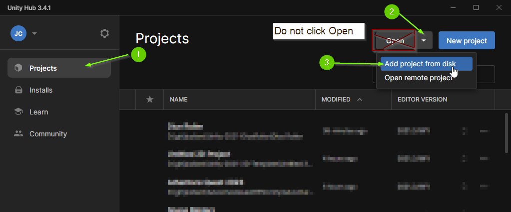
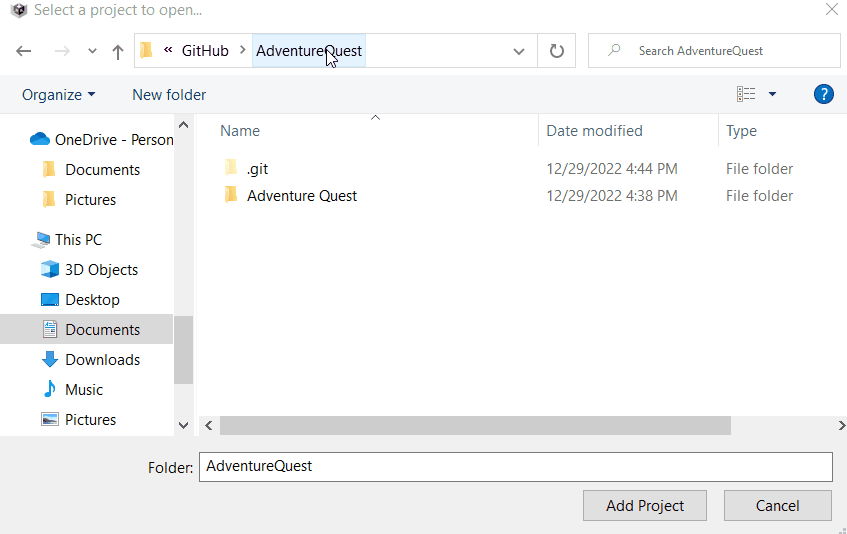
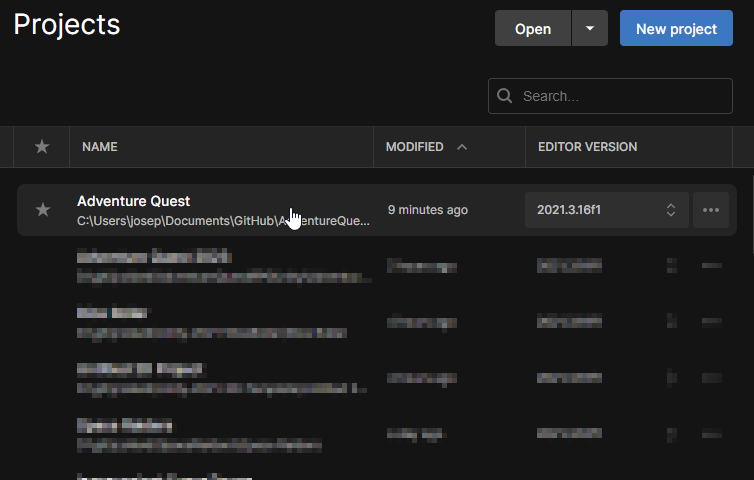

# Chapter 1: Setup
{: .no_toc }

In this section, you will import the base `Adventure Quest` project into Unity.
Before starting, you should ensure you have `Unity 2021.3.XX`. Although this
project may work with other versions, it has not been tested.

  

    Table of contents
  

  {: .text-delta }
1. TOC
{:toc}

# 01. Get the Project Template

Find the GitHub Classroom Link via Google Classroom

## Clone the Repository

1. Navigate to your Repository on GitHub.
2.  Click `Code` > `Open with GitHub Desktop`

This should launch GitHub Desktop.

5. Take note of the `Local path` setting. This is where the repository will be
   cloned. Optionally you can change the `Local path` setting. 

6. Click `Clone`

After a few moments, the template will be cloned to your computer. 

## Creating a Development branch
{: .no_toc }

It is typically considered bad practice to work directly on your projects `main`
branch. Instead, your team will typically have a development branch that will
eventually be added to `main` when your project is ready to be released.

Before beginning, you should create a `development` branch. Below are instructions
to create a branch using **GitHub Desktop**:



# 02. Adding Project to Unity Hub

**Note:** This guide was made using `Unity Hub 3.4.1`.

This project uses `Unity 2021.3.16f1`. Although this project *should* convert to
any version of `Unity 2021`, I highly recommend downloading this version for
compatibility.

1. Open Unity Hub
2. Click the `Projects` Tab
3. Click the arrow next to the `Open` button.
4. Click `Add project from disk`

5. Navigate to your repository and select the folder within called "Adventure
   Quest". This folder should contain a folder called `Assets`.

6. The `Adventure Quest` project should now appear in Unity Hub. Double Click to open it.

The first time the project is opened, it will take several minutes to load. 

# Good Time to Commit

Now would be a good time to make a `git` commit. You just finished a **chore**.
More specifically, you just initialized the Adventure Quest Unity project.



# What's next?

With the project setup and ready to go, you are ready for the next chapter.

---
