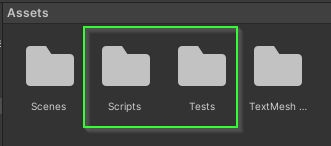
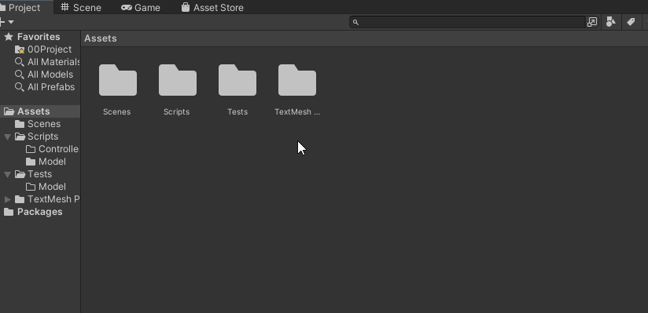
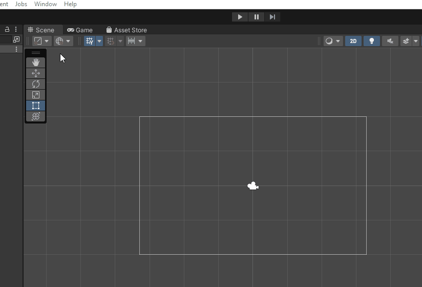
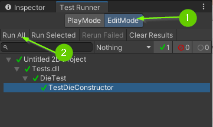
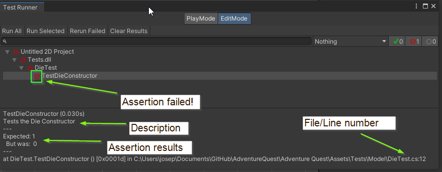
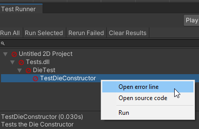
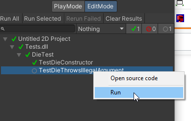
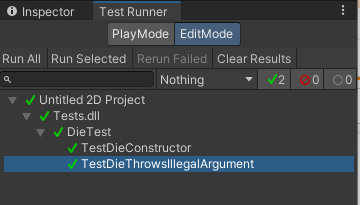

# Chapter 2: Modeling a Die
{: .no_toc }

In this chapter, you will have written a `Die` class which models a multi-sided
die that can be rolled. Additionally, you will learn how to use the Unity Test
Framework to test the `Die` class, giving you confidence that it works as
expected.


<details open markdown="block">
  <summary>
    Table of contents
  </summary>
  {: .text-delta }
1. TOC
{:toc}
</details>

# Code Structure in Adventure Quest

As a programmer, it is our responsibility to manage the complexity of a program.
It is far too easy to write a giant pile of spaghetti code in any language. But,
when you're working with something as powerful as Unity, it is even easier!

To help manage the complexity, the project template comes set up with 2 code
folders: `Scripts` and `Tests`. 



The `Scripts` folder will contain the code that
runs when Adventure Quest is played while the `Tests` folder will contain code
that helps give us confidence that each of our different components works the
way we expect it to. This is particularly helpful because we can test parts of
our program without running the game itself. These types of tests are called
**Unit Test** (they test small "units" of code).

# 00. Create a Feature Branch

It is considered bad practice to work directly on a branch that others might be
using (e.g. `main`/`development`). If you're the only one working on a project,
it can be tempting to do this (and you probably won't run into any issues). In
this project, we will focus on good practices. Thus, you should create a feature
branch. Branch naming is different from team to team but for this project I am
going to recommend using `{username}/{feature-name}`.




# 01. The Die Class

When programming, it is often useful to model real world objects as data. We can
do this by creating a **class**.  The word class is short for "classification"
and allows us to manage complexity by composing data and methods which operate
on that data together.

Before we begin, try to answer the following questions about a real physical die:

1. What properties makes a die a die? What about it can be observed?
2. What are the actions that I can take with a die?

These questions will help guide us think about how to write a **class** that
models a die.

## Create the Die Class
{: .no_toc }
Let's start by creating a `Die` class in the `Scripts/Model` folder.

1. Open the `Scripts` folder.
2. Open the `Model` folder.
3. Right click in the `Model` folder.
4. Select `Create` > `C# Script`.
5. Rename the file `Die`.
6. Double click to open the script.

By default, Unity will have added in default code for a `MonoBehaviour`. Start by
replacing the **entire** contents with the code below:

```csharp
using UnityEngine;

namespace AdventureQuest.Dice
{
    public class Die
    {

    }
}
```

The first line of code tells the compiler that we want to use code available
from the `UnityEngine`.

The next line says that we would like this code to be within a name space called
`AdventureQuest.Dice`. A name space allows us to manage the complexity of a
program and separate code that works together. Don't worry about this too much
right now, just know that this is a good habit and practice to have.

Within the name space we finally define a `class` called `Die`.  In this case,
we will be composing data together that is a "classification" for a `Die`.

## Properties of a Die
{: .no_toc }
Next, let's define the properties of a `Die`. 

Previously, you were asked to think about "What properties make a die a die?
What about it can be observed?"

When I think about a die, there are two properties that come to mind: 

* A die has a specific number of **Sides** 
* A die has a specific number that was **Last Rolled**

These will be the two **Properties** of our die. But, what data type will store
these values? Because these values happen to be discrete numbers, we will
represent them as integers.

Finally, will either of the properties change?

* In the case of **Sides**, no. The number of sides on a Die never changes.
* In the case of **LastRolled**, yes. The number that is currently seen will need to change.

With all of this information, we can add these properties to our class:

1. Update your code to have 2 properties: **Sides** and **LastRolled**

```csharp
public class Die
{
    /// <summary>
    /// The number of sides on this <see cref="Die"/>. This value
    /// is guaranteed to be greater than or equal to 2.
    /// </summary>
    public int Sides { get; }

    /// <summary>
    /// The value that was most recently rolled on this <see cref="Die"/>.
    /// This value will be between 1 and <see cref="Die.Sides"/>.
    /// If this <see cref="Die"/> has not been rolled, the value is 1.
    /// </summary>
    public int LastRolled { get; private set; }
}
```

Both `Sides` and `LastRolled` are `public` properties with a `get`. When we mark
a property `public` it exposes that value so it can be accessed throughout the
program. This is often called a **getter** (thus the word `get`).

However, `Sides` does not have a `set` (setter). This is because that value **never
changes**. When you have a property that cannot be changed, we say that it is
**immutable**. In general, making variables **immutable** is a good practice
because it typically reduces complexity.

Additionally, `LastRolled` has a `private set`. When we mark a property
`private` we do **NOT** expose it to the rest of the program. Instead, we
enforce that the property may only be modified within the class it was defined.
If a variable needs to change, it is a good practice reduce the number of ways
the variable can be modified. This is often called the [Principle of least
privilege].

In this case, `LastRolled` has specific rules for how the value will be set. By
marking it **private** we can guarantee that the value will not be modified
outside of this class, thus reducing the complexity of the program.

## Constructing a Die
{: .no_toc }
Next, we need a way to create an instance of a `Die`. To do this, we will define
a **constructor** that allows us to specify the number of **Sides** it has.

1. Update your Die class to include a **constructor** that accepts an `int` parameter.

```csharp
public class Die
{
    // Properties omitted for brevity

    /// <summary>
    /// Instantiates a <see cref="Die"/> specifying the number of <paramref
    /// name="sides"/>. A <see cref="Die"/> must have at least 2 <paramref
    /// name="sides"/>. 
    /// </summary>
    /// <exception cref="System.ArgumentException">
    ///     Thrown if <paramref name="sides"/> is less than 2.
    /// </exception>
    public Die(int sides)
    {

    }
}
```

A **constructor** is a special method used by a **class** to specify the
requirements to create an **object** of that type. In this case, a `Die` can
only be created if we are able to specify the number of sides it will have.
Because it doesn't make sense to have a die with fewer than 2 sides (what would
that even mean?) we add a comment which specifies that the `sides` parameter
must not be less than 2.

In addition to specifying the requirements to create an **object**, the
**constructor** also implements HOW the **object** is initialized. In this case,
how should we initialize the properties?

# Challenge: Write the Implementation for the Die constructor

Can you write the code that will correctly initialize a die? 

* What should the initial value for `Sides` be?
* What should the initial value for `LastRolled` be?
  * **Hint**: What does the comment for `LastRolled` say?

# 02. The DieTest Class

In the past, you have probably tested your code by simply running it as a
console program. In the case of Unity, it isn't always easy to simply test a
small portion of your code. To help manage this complexity, we will utilize
Unity's Test Framework to create **Unit Tests**.

The Template for Adventure Quest comes with a `Tests` folder that is configured
to connect with your `Scripts` folder. This is where you will write all of your
test code.

## Create a DieTest Class
{: .no_toc }
1. Open the `Tests` folder
2. Open the `Tests/Model` folder
3. Right click and select `Create` > `Testing` `C# Test Script`
4. Rename the file `DieTest`
5. Double click to open the file



### The First Test
{: .no_toc }
The main idea behind Unit Testing is to test small units of code. For our
first test, let's check that our constructor initializes a Die properly.

6. Update your `DieTest` file to contain the following code:

```csharp
using NUnit.Framework;
using System.Collections.Generic;
using AdventureQuest.Dice;

public class DieTest
{

    [Test, Timeout(5000), Description("Tests the Die Constructor")]
    public void TestDieConstructor()
    {
        Die d6 = new (6);
        Assert.AreEqual(6, d6.Sides);
        Assert.AreEqual(1, d6.LastRolled);

        Die d4 = new (4);
        Assert.AreEqual(4, d4.Sides);
        Assert.AreEqual(1, d4.LastRolled);
    }
}
```

The first three lines of code import the name spaces `NUnit.Framework`,
`System.Collections.Generic` and `AdventureQuest.Dice`. The first is the
framework that provides functionality for writing tests. The second contains
functionality for creating lists. The third is the name space we put our `Die`
class.

Next, we define the class `DieTest` which will contain all of the tests
associated with the `Die` class.

Just below that, we define a method `TestDieConstructor`. This method has 3
attributes: `Test, Timeout, and Description`. The `Test` attribute tells the
compiler that this method is a test and it should show up in Unity as such. The
`Timeout` attribute sets a time limit for how long this test should run (in this
case we specify 5000 milliseconds). The `Description` attribute allows us to add
a comment to the test that will appear in Unity.

Finally, the body of the `TestDieConstructor` constructs two instances of the
`Die` class: a `d6` and a `d4`. It also **asserts** that those instances are
initialized in the way we expect. In this case, we assert the number of
**Sides** on each `Die` is initialized properly as well as **LastRolled** being
initialized to 1.

### Running the Test
{: .no_toc }
So, you've added a test. How do you run it?

In Unity, you can access the `Test Runner` panel from the top menu: 

7. Select `Window` > `General` > `Test Runner`.



You can attach the `Test Runner` anywhere you think works well for you. Let's run the test!

8. Click `Edit Mode` in the `Test Runner` panel.
9. Click `Run All`. This will run all C# Test Scripts within the `Tests` folder.

If all went well, you should see a series of green check marks.



If any of the assertions within a test fails, the test will fail and you will
receive a red symbol. If you click on the failing test, you will see the tests
description, the assertion that failed, and the file / line number where the
assertion failed.



If this happens, you can right click on the failing test and select `Open error
line` to bring you to that specific line of code in your code editor.



If your `TestDieConstructor` method is failing, you should do your best to fix
it before moving on.

# 03. Ensuring a Die has at least 2 sides

You may have noticed the `Sides` property and `Die` **constructor** both
mentioned that a `Die` is guaranteed to have at least 2 sides. By having this
guarantee, it helps us (and our dev team) reason about how the object will work
in reality. But, what is preventing someone from constructing a `Die` by passing
in a negative number as an argument? If this happened, it could lead to some
very strange and undefined behavior later in the game.

Another good practice / principle to follow in software development is to
**[Fail-fast](https://en.wikipedia.org/wiki/Fail-fast#:~:text=In%20systems%20design%2C%20a%20fail,continue%20a%20possibly%20flawed%20process.)**.

The general idea is: If your program reaches an unexpected state, you should
fail (e.g. crash). This helps you identify bugs and problems within your code as
early as possible.

One way to do this in C# is to **throw** an **exception**. An **exception** is a
way to inform the program that it is in an "exceptional state" that it does not
know what to do with. For example, if the program discovers that there is a
`Die` with fewer than 2 sides, what should it do? It is undefined! Rather than
allowing an undefined behavior (and potentially a hard to find bug), we can
instead fail immediately and provide a good error message to help ourselves (or
our dev-team) debug the issue.

In this case, let's add in an error check within our `Die` constructor:

1. Update your constructor to throw a `System.ArgumentExcepetion` if the number
   of `Sides` specified is less than 2.


```csharp
public Die(int sides)
{
    if (sides < 2)
    {
        throw new System.ArgumentException($"A die must have at least 2 sides but found {sides}.");
    }
    Sides = sides;
    LastRolled = 1;
}
```

This code allows you to manage the complexity of your program because you now
know that the `Sides` property is guaranteed to be at least 2. Any bug related
to `Sides` being less than 2 will be reported during construction of a `Die`.

{: .note }
The error message explains **WHY** the exception happens. This message
is **NOT** designed for the user of the program but instead for someone working
on the code (you or your dev-team). If the developer writes code that has a
negative sides value, they will know immediately when the program attempts to
construct the die what the variable `sides` contains.

## Testing for Exceptions
{: .no_toc }

Using exceptions is so useful that the test framework provides tools for testing that
exceptions are thrown in specific situations! Let's add in an exception test to give
ourselves confidence that our program will throw an exception when sides is less than 2.

2. Update your `DieTest` class to test for exceptions:

```csharp
[Test, Timeout(5000), Description("Tests that a Die must be constructed with at least 2 sides")]
public void TestDieThrowsIllegalArgument()
{
    Assert.Throws<System.ArgumentException>(() => new Die(1));
    Assert.Throws<System.ArgumentException>(() => new Die(0));
    Assert.Throws<System.ArgumentException>(() => new Die(-1));
    Assert.Throws<System.ArgumentException>(() => new Die(-10));
    Assert.Throws<System.ArgumentException>(() => new Die(-50));
}
```

For now, don't worry too much about understanding **EXACTLY** what this code is
doing. The important part here is to know that it is **asserting** that calling
`new Die(1)`, `new Die(0)`, etc..., results in a `System.ArgumentException`
being thrown.

## Run the Test
{: .no_toc }
Back in Unity, your `Test Runner` panel should now have the
`TestDieThrowsIllegalArgument` test. If you would like, you can run all tests
again. Alternatively, you can right click on an individual test to run it alone.



3. Before continuing, run your test and ensure it is working



# 03. What does a Die do?
{: .no_toc }
Next, let's define what actions can be taken using a die.

Previously, you were asked to think about what actions can you take with a
physical die.

When I think about a die, there is one main action that comes to mind:

* Rolling the die **Roll()**

This action will become a method that: 

* Randomly selects a value between 1 and **Sides**
* Updates the **LastRolled** value
* Returns that value

To do this, we will utilize `UnityEngine`'s `Random` class. Since we have added
`using UnityEngine;` at the top of our script, we can call the
`Random.Range(low, high)` method to generate a number within a range. For example:

```csharp
int randomInt = Random.Range(0, 3);
```

The code above generates a random number that can be `0`, `1`, or `2`. It is
important to understand that the second value will never be returned and is an
**exclusive** upper bound.

1. Update your `Die` class to include a definition for a `Roll` method that
   accepts no parameters and returns an integer.

```csharp
/// <summary>
/// Rolls this <see cref="Die"/> setting the <see cref="Die.LastRolled"/> 
/// parameter to be a value between 1 and <see cref="Die.Sides"/> inclusively.
/// For convenience, this method returns the rolled value.
/// </summary>
public int Roll()
{
    return -1;
}
```

2. Update your `DieTest` class to include a test rolling a six sided die:

```csharp
[Test, Timeout(5000), Description("Tests rolling a 6 sided die 1,000 times.")]
public void TestSixSidedDie()
{
    // Construct a 6 sided die
    Die d6 = new(6);

    // Before rolling, the die should have a 1 on its face
    Assert.AreEqual(1, d6.LastRolled);

    // A 6 sided die should have 6 sides
    Assert.AreEqual(6, d6.Sides);

    // Roll this die 1,000 times and make sure it is always a value
    // between 1 and 6.
    List<int> values = new();
    for (int i = 0; i < 1_000; i++)
    {
        int result = d6.Roll();
        Assert.AreEqual(result, d6.LastRolled);
        Assert.LessOrEqual(result, 6);
        Assert.GreaterOrEqual(result, 1);
        values.Add(result);
    }

    // Check that each result was rolled
    Assert.Contains(1, values);
    Assert.Contains(2, values);
    Assert.Contains(3, values);
    Assert.Contains(4, values);
    Assert.Contains(5, values);
    Assert.Contains(6, values);
}
```

This test constructs a `Die` with 6 sides and rolls it 1,000 times. Each time it rolls
it checks that the result of the roll matches the value of `LastRolled` and is also
between 1 and 6.

Finally, after the 1,000 rolls, it checks that each value 1, 2, 3, 4, 5, and 6
were rolled at least once.

3. Update your `DieTest` class to include a test rolling a twelve sided die:

```csharp
[Test, Timeout(5000), Description("Tests rolling a 12 sided die 1,000 times.")]
public void Test12SidedDie()
{
    // Construct a 12 sided die
    Die d12 = new(12);

    // Before rolling, the die should have a 1 on its face
    Assert.AreEqual(1, d12.LastRolled);

    // A 6 sided die should have 6 sides
    Assert.AreEqual(12, d12.Sides);

    // Roll this die 1,000 times and make sure it is always a value
    // between 1 and 12.
    List<int> values = new();
    for (int i = 0; i < 1_000; i++)
    {
        int result = d12.Roll();
        Assert.AreEqual(result, d12.LastRolled);
        Assert.LessOrEqual(result, 12);
        Assert.GreaterOrEqual(result, 1);
        values.Add(result);
    }

    // Check that each result was rolled
    Assert.Contains(1, values);
    Assert.Contains(2, values);
    Assert.Contains(3, values);
    Assert.Contains(4, values);
    Assert.Contains(5, values);
    Assert.Contains(6, values);
    Assert.Contains(7, values);
    Assert.Contains(8, values);
    Assert.Contains(9, values);
    Assert.Contains(10, values);
    Assert.Contains(11, values);
    Assert.Contains(12, values);
}
```

This test works the same as the 6 sided die test but with a 12 sided die.

# Challenge: Implement the Roll Method

With your method stub in place as well as a few unit tests to give you
confidence that they are working, can you write an implementation to the `Roll`
method?

# Good Time to Commit

Now would be a good time to make a `git` commit and merge into your
`development` branch. You just finished a feature. More specifically, you just
implemented a `Die` class which models a fair die.





# What's Next?

With a model in place for a `Die` we are ready to create a Die Roller Scene!
Once you have passed all of the tests, you should proceed to [1.3: Creating a Die Roller Scene]

---


