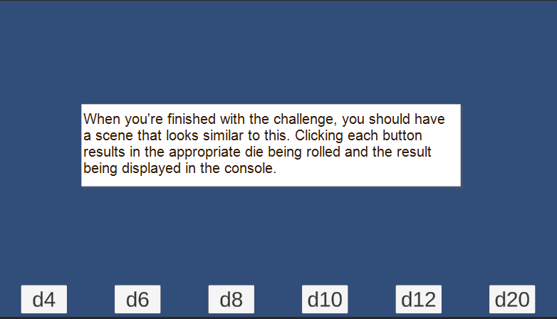
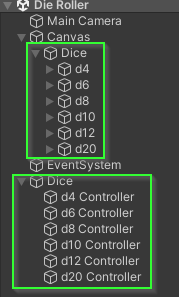
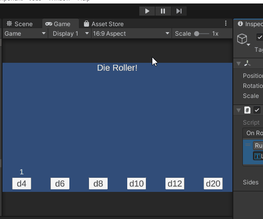
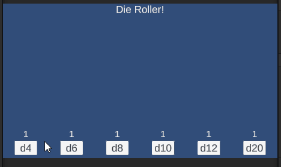

# Chapter 4: Adding an OnRoll Event
{: .no_toc }

In this part, you will learn how to add `UnityEvent`s to your scripts and
update elements on the screen when a `Die` is rolled.

Before starting, you should finish the challenge at the end of [Chapter 2:
Creating a Die Roller Scene] and have a scene that contains 6 `Die Controller`s
as well as 6 buttons that can roll each `Die`.




<details open markdown="block">
  <summary>
    Table of contents
  </summary>
  {: .text-delta }
1. TOC
{:toc}
</details>

# 00. Organize Your Hierarchy

After completing the challenge for part 2, my `Hierarchy` looks like this:



It is okay if your `Hierarchy` structure is different. However, throughout this
section, I refer to the `Hierarchy` as if it has the structure above.


# 01. Adding a Text Component

We would like to have the result of the die being rolled to be displayed above
the button that was clicked. To do this, we will add a text component to the
screen.

For practice, let's start by adding a "title" to the scene that says "Die Roller!"

1. Right click on the `Canvas` in your `Hierarchy`
2. Select `UI` > `Text - TextMeshPro`
3. Rename the element to be called `Title`


This is the same type of element as the text on the button's you've added previously.

# Challenge: Center Title at the Top of the Screen

* Update the `TextMeshPro - Text` component on `Title`
  * Change the title to "Die Roller!"
  * Update the font to be a size you find reasonable
* Update the `Rect Transform` component on `Title` 
  * Update the anchors and pivot to center it at the top of the screen
  * Update the width and height appropriately.

When you're finished, your scene should look similar to this:


# 02. Add a Result Label to a Die Button

Now that we have a little bit of practice with adding a text component to the
UI. Let's try adding a text component above the `d4` button.

1. Right click on the `d4` button in the `Hierarchy`
2. Select `Create Empty Parent`
3. Rename the new `GameObject` to be `d4 Group`


By doing this, we have "pushed" the `d4` button inside of a new `GameObject`
called `d4 Group`. This may have caused the `d4` button to adjust its
positioning within the `d4 Group` as it is no longer being controlled by the
`Horizontal Layout Group` of its previous parent (`Dice`).

By default, when you create a parent object surrounding others, it will set its
`Rect Transform` to encompass all of the inner object. However, the `d4` within
didn't update its anchors / position appropriately. One fix would be to 
set the anchors / pivot of `d4` to center in the parent. However, because we
want to add a Text label within, we will instead add a `Vertical Layout Group`
to `d4 Group` which will update the children appropriately.

4. Select `d4 Group` from the `Hierarchy`
5. In the `Inspector` select `Add Component`
6. Search for `Vertical Layout Group`
7. Add the component


After doing this, the button should "snap" back into place within the `d4
Group`. If it doesn't you may need to adjust the size of the `d4 Group` to have
a width and height that are at least as big as the `d4` button.

Finally, let's add a text component to the `d4 Group`

8. Right click on the `d4 Group`
9. Select `UI` > `Text - TextMeshPro`
10. Rename the component `Label`


In my scene, the text is very small and is disappearing off the bottom of the
scene. I would like the text to be a little bigger and centered above the
button.

11. Move the `Label` above the `d4` in the `d4 Group`


This will change the order they are added to the `Vertical Group`

12. Select the `Label` in the `Hierarchy`
13. Find the `TextMeshPro` component in the `Inspector`
14. Update the text to "1"
15. Update the font size to look "nice" (I've chosen 64)
    * You may need to update the `Height` of the `Rect Transform` to match.  
16. Update the `Alignment` to `Center`


Lastly, let's update the spacing and alignment of the `Vertical Layout Group`
to make the children look a little nicer:

17. Select `d4 Group` in the `Hierarchy`
18. Find the `Vertical Layout Group` in the `Inspector`
19. Adjust the spacing and alignment until you like the way it looks.
    * The image below shows the settings I chose:


After making these changes, my `d4 Group` was too big to fit inside the `Dice` parent
which caused it to go off the bottom of the scene again:


To fix this, you may need to update the height of the `Dice` parent to match the
height of the `d4 Group`.

Here is what the Scene looks like at this point:


# 03. Adding an OnRoll listener to DieController

Next, we would like to be able to update the text of the button any time the 
`d4 Controller` rolls. To do this, we are going to add a `UnityEvent` to the
`DieController` class. To use `UnityEvent`s we need to use the `UnityEngine.Events` name space.

1. Update the `DieController.cs` file to use the `UnityEngine.Events` name space.

```csharp
using UnityEngine;
using UnityEngine.Events; // <-- Required to use UnityEvents

namespace AdventureQuest.Dice
{
    public class DieController : MonoBehaviour { // omitted for brevity }
}
```

2. Update the `DieController` class to have a `UnityEvent<string>` property named `OnRollString`.
3. `OnRollString` should be `public` with a `get` and `private set`

```csharp
public class DieController : MonoBehaviour
{
    public UnityEvent<string> OnRollString { get; private set; }
    [field: SerializeField]
    public int Sides { get; private set; } = 6;
    // omitted for brevity
}
```

4. To access it from the `Inspector` add a `[field: SerializeField]` attribute.

```csharp
[field: SerializeField]
public UnityEvent<string> OnRollString { get; private set; }
```

A `UnityEvent` allows other elements of the game to "listen" for events to
occur. When we specify `UnityEvent<string>` we are creating an event that will
produce an `string`. In this case, that `string` will be the value that was rolled.
Thus, any object listening will not only know that the die was rolled BUT also
what the result was.

To trigger the event, we need to add it to the `Roll()` method.

5. Update the `Roll()` method to call `OnRoll.Invoke(_die.LastRolled.ToString())`

```csharp
public void Roll()
{
    _die.Roll();
    OnRollString.Invoke(_die.LastRolled.ToString());
}
```

This line of code converts the `_die.LastRolled` value to a string
and then sends the resulting string to all of the
"listeners" of the `OnRollString` event.

If all went well, you should be able to find the `OnRollString` event in the
`Inspector`.

6. Select `d4 Controller` from the `Hierarchy`
7. Find the `DieController` component


Let's add the `d4 Group`'s `Label` as a listener:

8. Click the `+` icon on the `OnRollString` event.
9. Drag the `Label` into the `None (Object)` slot


Lastly, we need to set the function to set the `text` to match the result.

10. Click the function drop down menu
11. Select `TextMeshProUGUI` > `text`
    * Be sure to select the `text` option that is listed toward the top under
      the `Dynamic string` section.


When the `OnRollString` event is invoked, it will send the `string` to the
`Label` which then uses that `string` to update its `text` property.

## Test it Out
{: .no_toc }
If all went well, you should now be able to run your program, click the `d4`
button and see the text update. Give it a try!



# Challenge: Add Die Labels to All Buttons

Can you update your scene such that each die button has a label that updates
when it is clicked?

When you're done, your scene should look and act similar to this:



# Good Time to Commit

Now would be a good time to make a `git` commit. You just finished a feature.
More specifically, you just added a `OnRollString` event to the `DieController`.
Before committing, be sure you save your `Die Roller` scene (Unity doesn't auto
save for you).



# What's Next?

If you've completed the challenge, you may have felt that "wiring" up all the
labels, controllers, and buttons was incredibly tedious. If you decide to make
changes to the buttons in the future, it will be painful to update all of them
again. In the next section, we will learn how to create a `Prefab` for a `Die
Button` to make it easy to add new buttons and more importantly update old
buttons!

After you have completed the challenge, you should proceed to [Chapter 4:
Creating a Die Button Prefab]

---
