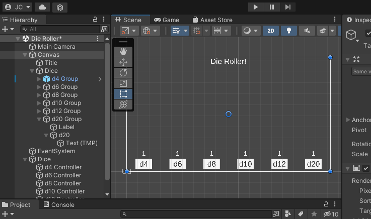

# Chapter 5: Die Button Prefab
{: .no_toc }

If you completed the challenge at the end of [Chapter 3: Adding an
OnRoll Event], you may have felt that "wiring" up all the labels, controllers,
and buttons was incredibly tedious. If you decide to make changes to the buttons
in the future, it will be painful to update all of them again. In this section,
we will learn how to create a `Prefab` for a `Die Button` to manage the
complexity of adding new buttons and updating existing buttons.

Before starting this section, you should complete [Chapter 3: Adding an OnRoll
Event] as well as the challenge at the end.

When you're ready, your scene should look and act similar to this:


<details open markdown="block">
  <summary>
    Table of contents
  </summary>
  {: .text-delta }
1. TOC
{:toc}
</details>

# 01. Creating a Die Button Prefab

In programming, we consider copy/paste coding a "code-smell". It is indicative
that we should refactor our code to use a method, class, or loop to reuse
existing code and manage the complexity.

The same thing can be said about performing the same work over and over in the
Unity editor / inspector. When this happens, it is usually a sign that we should
find a way to manage the complexity. In this case, we will use a `Prefab` to
manage the complexity of a `Die Button`.

The word `Prefab` is short for `Prefabrication`. Essentially, it is a "blueprint"
for a `GameObject` we would like to add to a `Scene`. If we update the `Prefab`
it will update all of the `GameObject`s throughout the project that use it.

## Create a Folder for Prefabs
{: .no_toc }
As always, we want to manage the complexity of our project. Let's start by
creating a place to store our prefabs.

1. Navigate to the `Assets` folder
2. Right click
3. Select `Create` > `Folder`
4. Rename the folder `Prefabs`


## Create a Prefab from an Existing GameObject
{: .no_toc }
Our `d4 Group` will serve as the initial template for our `Prefab`. To turn an
existing object into a `Prefab` you can drag it into a folder within the
`Project` panel.

5. Open the `Prefabs` folder
6. Drag the `d4 Group` from the `Hierarchy` into the `Prefabs` folder
7. Rename it to `Die Button`


If all went well, the `d4 Group` in the `Hierarchy` should be blue. This tells
us that this `GameObject` is a `Prefab`.

8. Double click on the `Die Button` prefab in the `Project` panel to open it


# 02. Creating a DieButton Script

Our goal is to make the `Die Button` completely self contained. That is, all of
the functionality should be encapsulated with a few control options in the
`Inspector` that will allow it to be customized when added to a `Scene`.
Currently, it is dependent on the `d4 Controller` within the `Scene`.

To do this, we will create a new `C# Script` called `DieButton` which will
have allow us to expose values to the `Inspector`.

Because the `DieButton` will be part of the User Interface, we will create a new
folder in our scripts directory for it.

1. Navigate to the `Scripts` folder
2. Create a new folder `UI`
3. Within the `UI` folder
4. Create a new `C# Script` called `DieButton`
5. Double click to open the `DieButton` script


* The `DieButton` acts as a `UI` element in our project so we will add it to the
  `AdventureQuest.UI` name space.

6. Update your `DieButton` class to be in the `AdventureQuest.UI` name space.
7. We won't need the `Update` method so remove it from the generated template

**Note:** We will use the `Start` method to initialize the `Prefab` so you can
leave it

```csharp
using UnityEngine;

namespace AdventureQuest.UI
{
    public class DieButton : MonoBehaviour
    {
        void Start()
        {

        }
    }
}
```

# 03. Requiring a DieController

A `DieButton` must be connected to a `DieController`. To enforce this, we
can use the `RequireComponent` attribute.

1. Update the `DieButton.cs` file to use the `AdventureQuest.Dice` name space
   * This allows access to the `DieController` class
2. Add the `[RequireComponent(typeof(DieController))]` attribute to the `DieButton` class

```csharp
using UnityEngine;
using AdventureQuest.Dice; // <-- Required to use DieController

namespace AdventureQuest.UI
{
    [RequireComponent(typeof(DieController))] // <-- Enforces that a DieController is available
    public class DieButton : MonoBehaviour { // omitted for brevity }
}
``` 

Next, add the `DieButton` script to the `DieButton` `Prefab`.

3. Select `Die Button` in the `Hierarchy`
   * Be sure you are editing the `Prefab`
4. In the `Inspector` select `Add Component`
5. Search for `DieButton`
6. Add the Component


**Notice**: By adding the `DieButton` script, it automagically added the
`DieController` script as well! This is because the `DieButton` script enforces
that the `GameObject` it is attached to must have a `DieController`.

# 04. Add Listeners to the Button and Die Controller

Now that we have a `Die Controller`, we can register it on the `Die Button`'s
`Button` listener.

1. First, rename the `d4` element to be `Button`


Our `Die Button` `Prefab` won't always have a `d4` so it doesn't make sense to
have a child component called `d4`.

Next, register the `DieController`'s `Roll()` method on the `Button`'s `OnClick`
event.

2. Select `Button` from the `Hierarchy`
3. In the `Inspector` find the `Button` component
4. Find the `On Click` listener
5. Drag the `Die Button` into the `None (Object)` space


6. Select the function drop down on the `Die Button` listener
7. Select `DieController` > `Roll()`


Finally, we must register the `Label` on the `DieController`'s `OnRollString` event.

8. Select `Die Button` in the `Hierarchy`
9. In the `Inspector` find the `DieController` component
10. Add a listener to the `OnRollString` by clicking the `+` button
11. Drag `Label` from the `Hierarchy` onto the `Object (None)` field


1.  Select the function drop down on the listener
2.  Select `TextMeshPro` > `text`


## Test the Die Button in the Die Roller Scene
{: .no_toc }
Before continuing, test that the `DieButton` `Prefab` is working as expected.

1. Return to the `Scene` by clicking the `<` button near the top of the Hierarchy` panel.


**Notice:** The `d4 Group` `GameObject` in the `Hierarchy` has "automagically"
been updated to reflect the changes made in the `Die Button` `Prefab`

2. Select `d4 Group` in the `Hierarchy`
3. Find the `Die Controller` component in the `Inspector`
4. Set `Sides` to `4`

**Notice:** After modifying a `Prefab` a small blue line appears on the left of
the `Inspector` next to the field. This indicates that this value has been
modified on this `Prefab` and won't be changed if the `Prefab` is modified.


5. Run the scene and verify that the `d4` button updates properly.

# 05. Adding Prefabs to the Scene

Next, let's replace each of the button groups with an instance of our `Die Button` prefab.

1. Delete each of the non-prefab button groups from the scene.



2. Drag the `Die Button` `Prefab` from the `Project` panel into the `Dice` group in the `Hierarchy`
3. Rename the object to `d6 Button`


Notice, the label of the button still says `d4`. We could edit the label in the
`Scene` for each of our buttons. This would require us to be change a child
component of the `Prefab`. Typically, we want all of the options of a prefab to
be accessible from the `Prefab`s root object.

# 06. Adding a ButtonLabel property to a DieButton

1. Update the `DieButton` class to have a `string` property named `ButtonLabel`
    * The property should be `public`, provide a `get`, and have a `private set`.
    * Initialize the property to be `string.Empty`
2. Add the `[field: SerializeField]` attribute to the property to expose it to the `Inspector`

```csharp
public class DieButton : MonoBehaviour
{
    [field: SerializeField]
    public string ButtonLabel { get; private set; } = string.Empty;

    void Start()
    {

    }
}
```

When the `DieButton` starts, we will check to see if the `ButtonLabel` has been
set in the `Inspector`. If it has not been set. We will initialize it to be
`d{Sides}` using the `DieController`s value. This gives the user flexibility to
set the `ButtonLabel` OR use a default value.

Because we have enforced that a `DieButton` requires a `DieController` using the
`RequireComponent` attribute. We can use the `GetComponent<DieController>()`
method to access the `DieController`.

3. Update the `Start()` method to check if `ButtonLabel == string.Empty`
4. If it is `string.Empty` set `ButtonLabel` to be $"d{sides}".
    * Use `GetComponent<DieController>().Sides` to get the number of sides.

```csharp
void Start()
{
    if (ButtonLabel == string.Empty)
    {
        DieController dieController = GetComponent<DieController>();
        int sides = dieController.Sides;
        ButtonLabel = $"d{sides}";
    }
}
```

## Test it in the Scene
{: .no_toc }
Before continuing, verify that the `ButtonLabel` field is visible in the
`Inspector` and that when you run the `Scene` the field is updated to match the
expected value.

**Note:** The label on the button will not update just yet.


# Good Time to Commit

Now would be a good time to make a `git` commit.
Since you have not yet finished a feature, this would be a work-in-progress
commit . More specifically, you just added a `Die Button Prefab`. Before
committing, be sure you save your `Die Roller` scene (Unity doesn't auto save
for you).



# Challenge: Add an OnLabelChange Event to the Die Button Prefab

Alright! You're almost there. All that is left is to update the `Button`'s text
when the `DieButton` starts: To do this, you will:

1. Add a `UnityEvent<string> OnLabelChange` property
  * Follow good practices with a `private set`
  * Expose it to the `Inspector` using the `[field: SerializeField]` attribute
  * You will need to use the `UnityEngine.Events` name space to access the `UnityEvent` class.
2. Update the `Start()` method to call `OnLabelChange.Invoke(ButtonLabel)`
  * This should happen after the label has been initialized
  * This should *always* happen exactly once (even if the label wasn't set)
3. Update the `Button`'s `Text` component to default to `d??`
4. Register the `Button`'s `Text` component to listen to the `OnLabelChange` event
   * When it occurs, the `TextMeshPro`'s `text` property should update

**Hint:** In [1.3: Adding an OnRoll Event], we added an `OnRollString`
event to the `DieController`. You should be able to apply the same steps here.

When you've finished the `DieButton` component should look like this:


Additionally, when you run the `Die Roller Scene`, the button labels should
"automagically" update.


# Challenge: Add the Remaining DieButton Prefabs to the Scene

Now that you have a nice `Die Button` `Prefab`, you can delete all of the `DieController`s
from the `Die Roller` `Scene` and add `Die Button` `Prefab`s in their place.

1. Delete the `Dice` group containing your previous `DieController`s
2. Add `Die Button` `Prefab`s for the remaining dice.

When you're finished, your scene should look and act like this:


# Good Time to Merge

Now would be a good time to make a `git` commit and merge into `development`.
You have just finished a feature. More specifically, you have implemented a Die
Roller Scene.





# What's Next

Congratulations! You've completed **Part 1: Creating a Die Roller**!

In **Part 2** you will create a `DicePool` class that allows for complex
combinations of dice to be rolled together. For example, a weapon might deal
damage equal to the result of rolling 2 six-sided dice and 3 four-sided dice. In
table top RPG lingo this would be `2d6 + 3d4`. 

Additionally, in **Part 2** you will create a `Roll Analysis` tool to explore
the probability of the outcomes that rolling a `DicePool` could produce. For
example with `2d6 + 3d4` we know the minimum is 5 (5 dice total) and the maximum
is 24 (2*6 + 3*4) but what are the odds of rolling a `12`?  

When you're ready, continue to [Part 5: Modeling a Dice Group](../05-DiceGroup/README.md)

---
