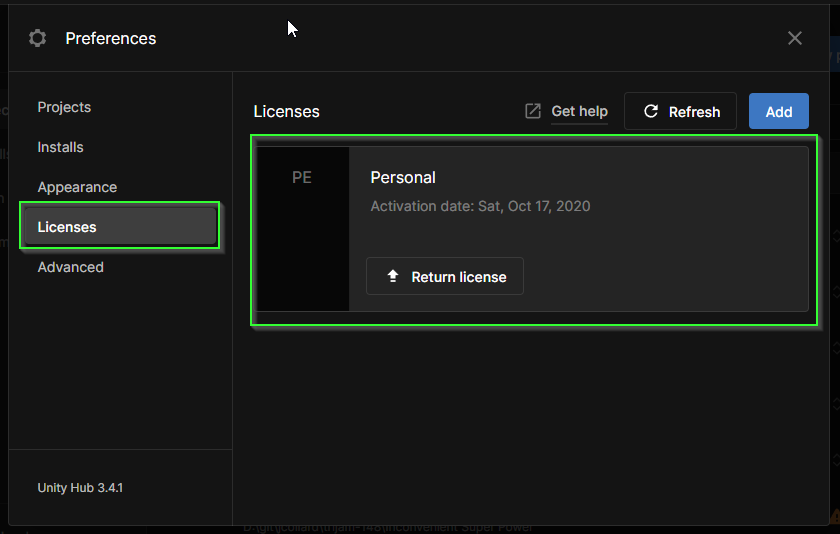

# Unity
{: .no_toc }

  

    Table of contents
  

  {: .text-delta }
1. TOC
{:toc}

# Sign up for a Unity ID

If you already have a Unity ID, you can skip this section.

1. Visit Unity's website: [https://unity.com/](https://unity.com/)
2. In the top right corner, click the "Avatar Icon"
3. Select `Create a Unity ID` from the menu that appears

{: .warning } 
After clicking `Create a Unity ID`, do **not** fill out the form.

1. Scroll to the bottom of the `Create a Unity ID` page.
2. Click the Google Authentication Icon

1. After authenticating, click the agree to terms check box
2. Click continue

# Download Unity Hub

You should now be on your Unity ID account page.

1. Click the Avatar Icon on the top right
2. Click `Download Unity`

{: .note }
Alternatively, you can access the link directly here: [https://unity.com/download](https://unity.com/download)

On the next page, you will download **Unity Hub**. **Unity Hub** is a program
that manages all of the installations you might need related to **Unity**.

You should see a big "Download for XXX" button on this page. Click the download
button.

After the file is downloaded, follow the installation instructions for your operating system.

# Add Unity ID to Unity Hub

1. If you have not done so already, open **Unity Hub**
2. Click the avatar icon in the top left
3. Click `Sign in`
4. This will open a web browser.
5. If necessary, authenticate with google again
6. If prompted, click "Open Unity Hub"

# Verify Personal License

To use Unity, you are required to have a license. Lucky for you, there is a free
to use **Personal License** that gives you the ability to create and publish
games so long as you do not earn more than $100,000 from products you make with
Unity. If you already have a **Personal License**, you can skip this section.

{: .note }
If for whatever reason you happen to earn more than that, these
instructions will not help you.

1. In Unity Hub, click your avatar icon
2. Select `Manage Licenses`

Verify that you have a personal license. Click the `Licenses` option on the
left. You should see a personal license. If you do not, there are instructions
after the image below.

## Add new Personal License

If you do not have a personal license, you can add one.

* Click the `Add License` button

* Select `Get a free personal license`

* Click `Agree`. After a few seconds, you should see a screen like the one below:

# Install Unity 2021.3.16f

Throughout this class, we will use the current **Long Term Support** version of
Unity (2021.3.16f1). This version of Unity is considered to be the current
**STABLE** release. 

{: .note }
It is fine to have multiple different versions of Unity installed. However, 
each one has different features. For all of the projects in this class, you
should use `2021.3.16f1`

1. If you have not done so, open **Unity Hub**
2. Click the `Installs` tab from the left menu
3. Click `Install Editor` in the top right

4. Verify the version you are installing says `2021.3.16f1`
    * If it is not `2021.3.16f1`, you should search for it in the `Archive` tab.
5. Click `Install`

6. Unselect `Visual Studio Community` (we will use VS Code in this course)

7. Select `WebGL Build Support` (We will be publishing your projects to the web!)
8. Select `Documentation` (This is super helpful to have when editing code)
9. Click `Install`

{: .note } 
The download is quite large and may take some time to download. While this is
occurring, you should continue to install the rest of the class software.

