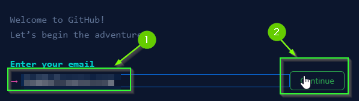

# GitHub
{: .no_toc }

GitHub is a platform hosted by Microsoft for managing `git` repositories. A
`git` repository is a **Version Control System** that allows developers to
easily manage code for themselves and their teams. We will use GitHub in this
class for all of our projects.

  

    Table of contents
  

  {: .text-delta }
1. TOC
{:toc}

# Sign up for GitHub

If you already have a GitHub account, you can skip this section.

1. Visit GitHub's website: [https://github.com/](https://github.com/)
2. Click the `Sign Up` button

1. Enter your email address
2. Click Continue

3. Enter a password
4. Click Continue
5. Enter a username
6. Click Continue
7. Enter "n" (you don't want to receive product updates)
8. Click Continue
9. If prompted to solve a puzzle. Solve the puzzle
10. Click `Create Account`

You will need to verify your email:

11. On the next page, select the `Skip Personalization` at the bottom of the page

After a moment, you should be logged in!

# Download GitHub Desktop

In this class, we will use **GitHub Desktop** to help manage our repositories.

1. Visit [https://desktop.github.com/](https://desktop.github.com/)
2. Click the Download button
3. Follow the Installation instructions for your operation system

# Authenticate GitHub Desktop

1. If you have not done so already, open **GitHub Desktop**
2. From the top bar, select `File`
   * On Mac, select `GitHub Desktop`
3. Click `Options`

4. Select the `Accounts` tab
5. Select the `Sign in` button under "GitHub.com"

6. If prompted, select "Open Browser"
7. If prompted, select `Authorize Desktop`

8. If prompted click `Open GitHubDesktop`

If all went well, you should be able to see your username in the `Accounts` tab within **GitHub Desktop**.

# What's Next

With **GitHub Desktop** installed, you're ready to manage your projects source
code! Next, you should install VS Code along with all of the necessary
extensions to help develop with Unity. 

