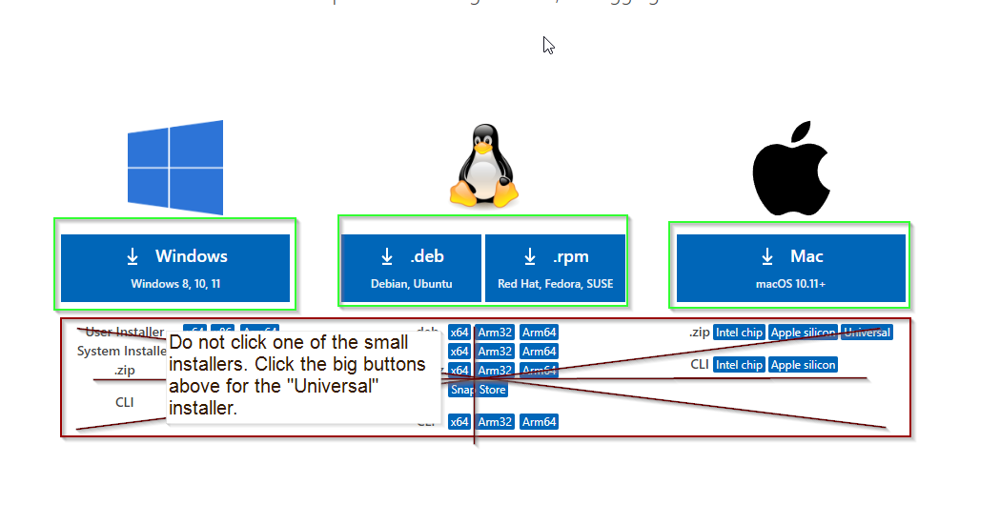
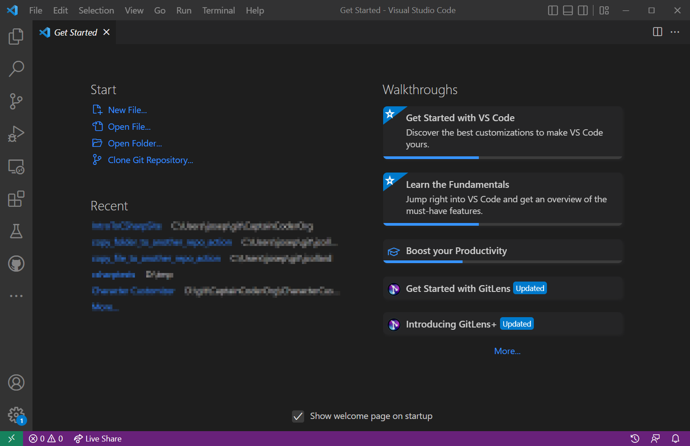
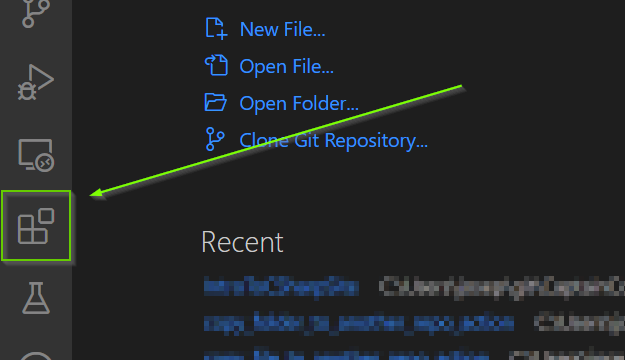
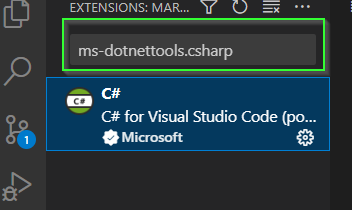
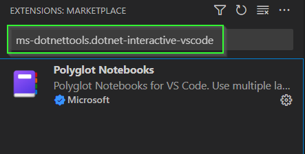
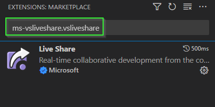
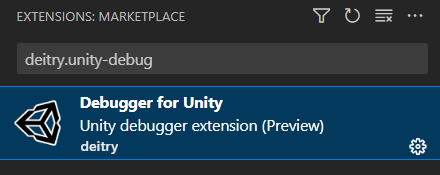

# VS Code
{: .no_toc }

VS Code is a lightweight but powerful source code editor editor that runs on
Windows, Mac OS, and Linux. It is free, has a large active development
community, and provides an easy tool chain to allow developers to write custom
extensions.

  

    Table of contents
  

  {: .text-delta }
1. TOC
{:toc}

# Download VS Code

If you already have VS Code installed, you can skip to the installing extensions section.

1. Visit [https://code.visualstudio.com/Download](https://code.visualstudio.com/Download)
2. Select the Installer for your OS (Click the big button, not the small buttons)

After downloading, follow the on screen instructions to finish installation.

# Installing Extensions

To help with development, we will install several VS Code Extensions.

1. If you have not done so already, open VS Code

2. Open the Extensions tab on the Left Bar

## C# Extension

1. In the search bar, enter `ms-dotnettools.csharp`

2. Select `Install`

## Polyglot Notebooks

1. In the search bar, enter `ms-dotnettools.dotnet-interactive-vscode`

2. Select `Install`

## Live Share

1. In the search bar, enter `ms-vsliveshare.vsliveshare`

2. Select `Install`

## Debugger for Unity

1. In the search bar, enter `deitry.unity-debug`

2. Select `Install`

# What's Next

Woohoo! Everything is installed and ready to go. You're ready to configure your first Unity project!

